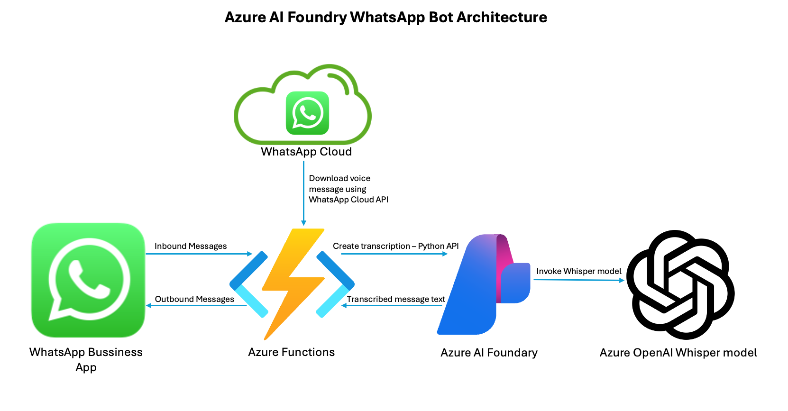

# Azure AI Foundry Whatsapp Bot

## Overview 
This GitHub repository walks you through creating a WhatsApp Bot built with Azure Functions, Azure AI Foundry and Azure OpenAI Whisper model, using Python.

## Architecture

 - A user gets a voice message. He/She then forwards the message to the WhatsApp Business number. 
 - WhatsApp Business app gets the message and sends it to the Azure Functions using a Webhook.
 - Azure Functions gets the message. If is is a voice messsage, then call `client.audio.transcriptions.create` Python API to invoke Azure OpenAI Whisper model, deployed in Azure AI Foundry.
 - Transcribed text is returned from Azure OpenAI Whisper model to Azure Function, and from the to the WhatsApp Business app.

## Prerequisites

 - Azure Subscription with permissions to create the following Azure resources: Resource Groups, Storage Accounts, Function Apps, and AI Foundry (formerly named AI Studio).
 - A Meta for Developers account — If you don’t have one, you can create a Meta for Developers account [here](https://developers.facebook.com/).
 - Familiarity with Azure and the Azure Portal.
 - Basic Python knowledge is required to follow this tutorial.

## Instructions

Referr to the **Build a WhatsApp Transcription Bot with Azure Functions, Azure AI Foundry and Azure OpenAI Whisper model: A Step-by-Step Guide** [Blog Post on Medium](https://medium.com/@eitansela/build-a-whatsapp-transcription-bot-with-azure-functions-azure-ai-foundry-and-azure-openai-whisper-8617bbaae821)

